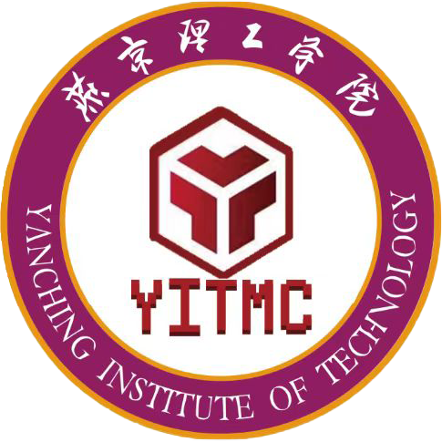

<div align="center">



# YITMC · 燕京理工学院 MC 玩家创作协会

**交流 · 学习 · 创新 · 协作**

燕京理工学院官方注册学生社团 —— 官方网站源码

[](https://vuejs.org/)
[](https://vite.dev/)
[](https://www.typescriptlang.org/)
[](https://tailwindcss.com/)
[](#许可证)

[📺 哔哩哔哩](https://space.bilibili.com/3546886464080420) ·
[🎵 抖音](https://www.douyin.com/user/MS4wLjABAAAA-7Qqtyf0Wz2A18bvNLF8YYD5nRWCiX25Wsx7JfgXePc?from_tab_name=main) ·
[💬 QQ 群 942717135](https://qm.qq.com/q/942717135) ·
[🎨 皮肤站](https://skin.yitmc.cn/)

</div>

---

## 简介

YITMC（燕京理工学院 MC 玩家创作协会）官方门户网站，采用**像素体素风格**主题设计，展示社团的建筑作品、活动动态与成员风采。基于 Vue 3 + Vite + TypeScript 构建，全站内容由 JSON 数据驱动，无需改代码即可更新。

## 技术栈

- **框架**: Vue 3 (Composition API)
- **构建**: Vite 6
- **语言**: TypeScript
- **样式**: CSS Custom Properties + Tailwind CSS 4
- **路由**: Vue Router 4
- **动画**: GSAP + CSS Animations + Intersection Observer + requestAnimationFrame

## 页面路由

| 路径 | 页面 | 说明 |
|------|------|------|
| `/` | 首页 | Logo、社团简介、精选作品、数据亮点、MC 服务器状态、社交媒体 |
| `/works` | 作品展示 | 分类筛选（复原工程/其他建筑/社团合照）、图片网格、详情弹窗 |
| `/news` | 社团动态 | 时间线布局的活动公告与项目进展 |
| `/members` | 成员风采 | 社团管理团队展示 |
| `/about` | 关于我们 | 社团简介、宗旨、官方信息、组织成员、联系方式 |
| `/join` | 加入我们 | QQ群/微信群二维码、皮肤站、社交媒体、FAQ |

## 项目结构

```
YITMC/
├── public/ → ../img        # 静态资源（图片）
├── img/                     # 图片资源
│   ├── logo/               # 社团 Logo
│   ├── Background/         # 作品截图
│   │   ├── 复原工程/       # 校园复刻工程
│   │   ├── 其他建筑工程/    # 其他建筑作品
│   │   └── 社团合照/       # 社团合影
│   └── people/             # 成员头像
├── src/
│   ├── components/
│   │   ├── icons/          # SVG 图标组件
│   │   ├── layout/         # 布局组件（Header/Footer/Background）
│   │   ├── ui/             # 通用 UI 组件
│   │   ├── home/           # 首页区块组件
│   │   ├── works/          # 作品展示组件
│   │   ├── news/           # 社团动态组件
│   │   ├── members/        # 成员风采组件
│   │   └── join/           # 加入我们组件
│   ├── views/              # 页面视图（6 页）
│   ├── router/             # 路由配置
│   ├── data/               # 静态数据（JSON）
│   ├── styles/             # 全局样式
│   └── composables/        # 组合式函数
├── vite.config.ts
├── tsconfig.json
└── package.json
```

## 数据配置

所有内容通过 `src/data/` 目录下的 JSON 文件配置，无需修改代码：

| 文件 | 内容 |
|------|------|
| `site-config.json` | 社团名称、社媒链接、QQ群号、外部链接等全局配置 |
| `works.json` | 作品分类与作品列表（图片路径、描述、作者、日期） |
| `news.json` | 社团动态/公告列表 |
| `members.json` | 管理团队成员信息（姓名、头像、角色、简介） |
| `stats.json` | 首页数据亮点数字 |
| `servers.json` | 首页服务器状态组件的 MC 服务器列表（名称、地址、端口） |

> **服务器状态组件**：实时查询各服务器的在线人数、延迟、版本与 MOTD，支持一键复制地址与手动刷新。
> 状态数据来自公开 API（mcstatus.io / mcsrvstat.us / minetools），无需自建后端；
> `displayAddress` 字段可为服务器配置对外展示的打码地址（如 `unioncompute.***`），真实地址仅用于查询。

## 本地开发

### Windows 快速启动（推荐）

命令行启动见下方；`start-test.*` 脚本已移除，直接使用 `npm run dev` 即可。

### 命令行启动

```bash
# 安装依赖
npm install

# 启动开发服务器（默认端口 25565，与 MC 服务器默认端口一致 :)
npm run dev

# 指定端口
npx vite --port 自定义端口
```

开发服务器启动后访问 `http://localhost:25565`。

## 生产部署

### 方式零：GitHub Actions 自动部署（已内置）

仓库已包含 `.github/workflows/deploy.yml`：每次推送到 `main` 分支会自动构建，
并通过 rsync over SSH 上传 `dist/` 到社团服务器（服务器 FTP 未开放，走 SSH）。
首次启用只需在仓库 **Settings → Secrets and variables → Actions** 中配置
`DEPLOY_HOST` / `DEPLOY_USER` / `DEPLOY_KEY`（可选 `DEPLOY_PORT`，默认 22）。
未配置密钥时工作流只执行构建检查，部署步骤自动跳过。

> 部署时始终排除服务器上的 `data/`、`uploads/`、`admin-config.php`（后台运行数据）。

### 方式一：静态托管（推荐）

```bash
# 构建生产版本
npm run build

# 产物在 dist/ 目录，部署到任意静态服务器
# 示例：Nginx、Vercel、Netlify、GitHub Pages、Cloudflare Pages
```

将 `dist/` 目录的全部内容上传至静态服务器根目录即可。

**重要**：站点使用 Vue Router 的 HTML5 History 模式，部署时需要配置服务端将所有路由指向 `index.html`。

#### Nginx 配置示例

```nginx
server {
    listen       80;
    server_name  your-domain.com;
    root         /path/to/dist;
    index        index.html;

    location / {
        try_files $uri $uri/ /index.html;
    }

    # 静态资源缓存
    location /assets/ {
        expires 1y;
        add_header Cache-Control "public, immutable";
    }
}
```

#### Vercel / Netlify

无需额外配置，平台默认支持 Vue Router History 模式。

#### GitHub Pages

在 `vite.config.ts` 中添加 `base` 配置：

```typescript
export default defineConfig({
  base: '/yitmc-website/',
  // ...
})
```

### 方式二：Docker

```dockerfile
FROM node:20-alpine AS build
WORKDIR /app
COPY package*.json ./
RUN npm ci
COPY . .
RUN npm run build

FROM nginx:alpine
COPY --from=build /app/dist /usr/share/nginx/html
COPY nginx.conf /etc/nginx/conf.d/default.conf
EXPOSE 80
CMD ["nginx", "-g", "daemon off;"]
```

### 方式三：Node.js 服务器

```bash
# 使用 vite preview 预览生产构建
npm run build
npm run preview
```

## 更新网站内容

1. 修改 `src/data/` 下的 JSON 文件
2. 添加/替换图片到 `img/` 目录
3. 重新构建部署：`npm run build`

## 图标系统

使用自定义 SVG 图标组件 `AppIcon.vue`，位于 `src/components/icons/`。支持 20+ 图标，通过 `name` prop 指定。禁止使用 Emoji 作为图标。

## 联系我们

| 渠道 | 地址 |
|------|------|
| QQ 群 | [942717135](https://qm.qq.com/q/942717135) |
| 哔哩哔哩 | [@燕理MC玩家创作协会](https://space.bilibili.com/3546886464080420) |
| 抖音 | [@燕理MC玩家创作协会](https://www.douyin.com/user/MS4wLjABAAAA-7Qqtyf0Wz2A18bvNLF8YYD5nRWCiX25Wsx7JfgXePc?from_tab_name=main) |

## 相关链接

- [燕京理工学院](https://www.yit.edu.cn/)
- [MUA 高校 Minecraft 联盟](https://www.mualliance.cn/)
- [VCAC 体素创作艺术委员会](https://www.voxel.ac.cn/)
- [社团皮肤站](https://skin.yitmc.cn/)

## 许可证

本项目为燕京理工学院 MC 玩家创作协会官方网站，代码与素材（含 Logo、作品截图、成员照片）保留所有权利，未经许可请勿商用或二次分发。

<div align="center">

**Minecraft®** 是 Mojang Studios 的商标。本社团及本站与 Mojang Studios、Microsoft 无从属关系。

</div>
